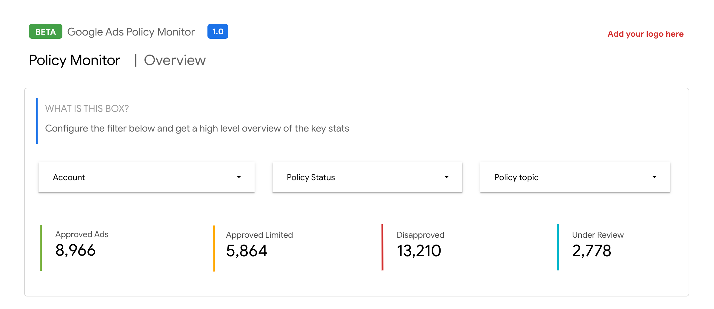
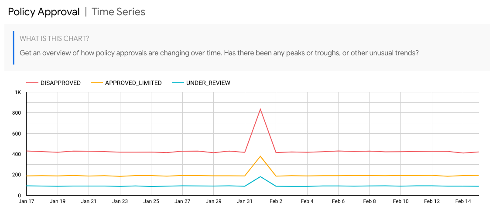
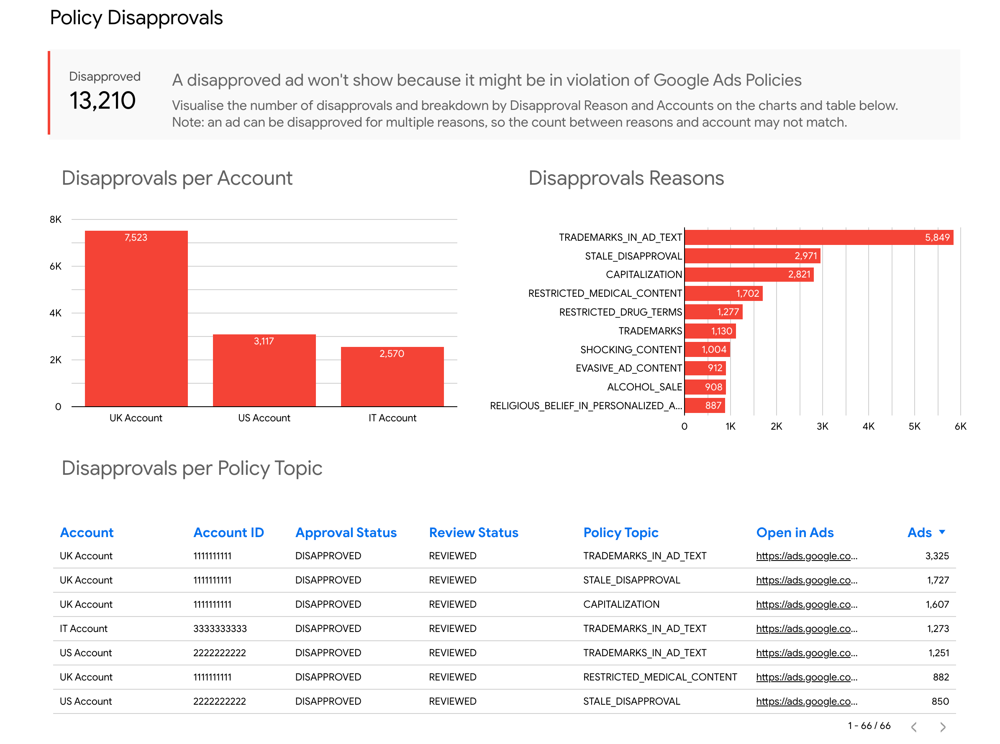
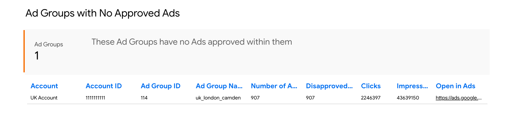
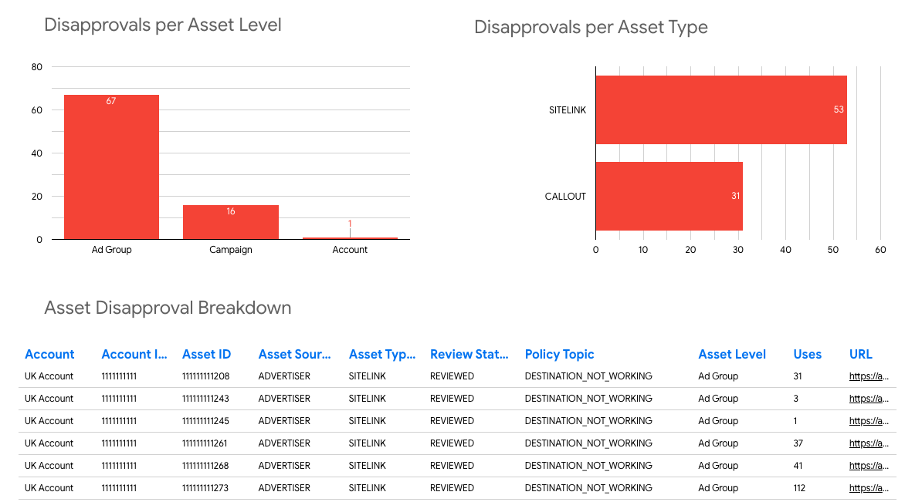
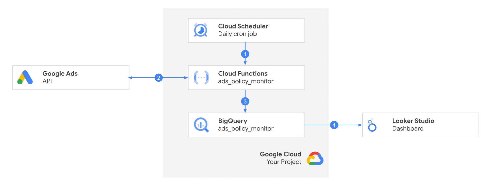

# Ads Policy Monitor

_Providing a 1-stop-shop, centralized view of all your Google Ads policy
reports._

Ads Policy Monitor provides a data pipeline for pulling ad and asset approval
data from Google Ads, enabling you to monitor trends and spikes with policy
approvals.

## Solution Overview

To keep ads safe and appropriate for everyone, ads are reviewed to make sure
they comply with Google Ads policies,
[read more here](https://support.google.com/google-ads/answer/1722120?sjid=13030684844768437853-EU).

For large advertisers and agencies, it can be challenging to monitor the state
of your ad copy across all of your Google Ads accounts. This can be amplified
when automation is used to create ad copy, as it's easy to introduce mistakes
that result in ads being disapproved, for example, the incorrect use of
capitalisation.

This solution pulls a daily snapshot of your ad and asset policy approvals,
stores them in BigQuery, and provides a Looker Studio dashboard template to
monitor this.

When disapprovals happen you can take action by following the deeplink into
Google Ads to get more information and take action.

In the dashboard you can instantly monitor the overall status of your accounts:


And how this changes over time. This allows you to identify any changes in the
trend, to investigate further.


You can drilldown into the disapprovals to try to get more information about why
this has happened:


You're also able to see insights like when an ad group has no approved ads:


And analyze asset disapprovals:


## How does it work?



1.  A daily cron job runs that makes a HTTPS request to trigger the
    `ads_policy_monitor` Cloud Function.
2.  The Cloud Function uses
    [Google Ads Query Language (GAQL)](https://developers.google.com/google-ads/api/docs/query/overview)
    to run a number of reports in Google Ads via the API.
3.  The output of these reports is written to a dataset in BigQuery called
    `ads_policy_monitor`.
4.  We provide a template Looker Studio dashboard to visualise this data.
    However, there is nothing to stop you using your own dashboard solution. For
    example, it is possible to connect this data with the Looker Platform for
    more advanced BI reporting, alerting, data drilldown etc.

## Requirements

-   A Google Cloud Project
-   Access to the Google Ads API (e.g. developer token, account access),
    [see getting started](https://developers.google.com/google-ads/api/docs/get-started/introduction).
-   Access to Looker Studio or a dashboard solution that can connect to
    BigQuery.
    -   If you wish to have access to the
        [Looker Studio template provided by Google](https://lookerstudio.google.com/c/u/0/reporting/13995d1f-741c-40f0-934c-9517e2ffc361/),
        please join this group
        [ads-policy-monitor-template-readers](https://groups.google.com/g/ads-policy-monitor-template-readers).

## Deployment

To install it, click on the blue Deploy button and follow the instructions in Google Cloud:

[](https://console.cloud.google.com/?cloudshell=true&cloudshell_git_repo=https://github.com/google-marketing-solutions/ads-policy-monitor&cloudshell_tutorial=walkthrough.md)

## FAQ

### Which Google Cloud APIs will be enabled to my project?

- Big Query API `bigquery.googleapis.com`
- Cloud Build `cloudbuild.googleapis.com`
- Cloud Funtions `cloudfunctions.googleapis.com`
- Cloud Resource Manager API `cloudresourcemanager.googleapis.com`
- Google Ads API `googleads.googleapis.com`
- Identity and Access Management (IAM) `iam.googleapis.com`
- Secret Manager `secretmanager.googleapis.com`
- Cloud Run `run.googleapis.com`
- Cloud Scheduler `cloudscheduler.googleapis.com`

You can also check this on the deployment file [ads-policy-monitor/init.sh](https://github.com/google-marketing-solutions/ads-policy-monitor/blob/main/init.sh#L78-L87).

### Which GAQL queries are executed?
Please refer to the folder google_ads_queries [cloud_functions/ads_policy_monitor/gaql](https://github.com/google-marketing-solutions/ads-policy-monitor/tree/main/cloud_functions/ads_policy_monitor/gaql).


### Can I deploy it in an existing Cloud Project or do I need to create a new one just for this solution?
You can use an existing Project if you want to. However, please remember that the best practice for clients is to create a new project dedicated to this solution (or any new solution).

### Can this solution refresh the data more often than once a day?
You can make the Cloud Scheduler run more often than once a day, however you'd need to also make some customization in the code as the code and templates provided here would show duplicated records.

The reason this solution was designed to run once a day was based on learnings from hundreds of deployments, where the tradeoff between solution costs and Policy Reviews turn-around time was taken into consideration.

If youy still wish to make the refresh rate higher, these are some of the adjustments you'd have to perform:
1. Introduce time into the [`event_date`](https://github.com/google-marketing-solutions/ads-policy-monitor/blob/main/cloud_functions/ads_policy_monitor/gaql/ad_policy_data.sql#L15) parameter of the queries.
2. Update the [cron schedule](https://github.com/google-marketing-solutions/ads-policy-monitor/blob/main/terraform/main.tf#L264) to run more frequently.
3. Update the [partitioning on the BigQuery table](https://github.com/google-marketing-solutions/ads-policy-monitor/blob/main/terraform/main.tf#L48) to hourly.
4. Update the [latestadpolicy data query](https://github.com/google-marketing-solutions/ads-policy-monitor/blob/main/bigquery/views/latest_ad_policy_data.sql#L37) to filter on only the latest data.
5. Refresh your Looker Studio dashboard data source to mke sure the `event_date` is now a datetime and instead of just date.


## Contributing

### Code formatting

The code is formatted using [yapf](https://github.com/google/yapf). After making
a change, before submitting the code please do the following:

Install the dev requirements:
```
pip install -r requirements_dev.txt
```

Then run yapf:

```
yapf --style google -r -i .
```

## Disclaimers
__This is not an officially supported Google product.__

Copyright 2024 Google LLC. This solution, including any related sample code or
data, is made available on an “as is,” “as available,” and “with all faults”
basis, solely for illustrative purposes, and without warranty or representation
of any kind. This solution is experimental, unsupported and provided solely for
your convenience. Your use of it is subject to your agreements with Google, as
applicable, and may constitute a beta feature as defined under those agreements.
To the extent that you make any data available to Google in connection with your
use of the solution, you represent and warrant that you have all necessary and
appropriate rights, consents and permissions to permit Google to use and process
that data. By using any portion of this solution, you acknowledge, assume and
accept all risks, known and unknown, associated with its usage, including with
respect to your deployment of any portion of this solution in your systems, or
usage in connection with your business, if at all.
